# Лабораторная работа №4
Нужно было восстановить видео.

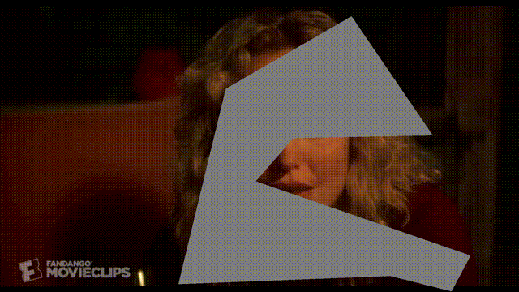

## Был использован следующий пайплайн:
1. Видео разделено на кадры (./scripts_for_preprocessing/split_video_on_frames.py)
1. Вручную найдена область с маской
1. Вырезана область с маской (./scripts_for_preprocessing/crop_image.py)
1. Созданы маски для каждого изображения (по сути это одна и та же маска) (./scripts_for_preprocessing/make_mask.py)
1. Скачан репозиторий MAT ( `git clone https://github.com/fenglinglwb/MAT` )
1. Скачены [веса](https://mycuhk-my.sharepoint.com/personal/1155137927_link_cuhk_edu_hk/_layouts/15/onedrive.aspx?id=%2Fpersonal%2F1155137927%5Flink%5Fcuhk%5Fedu%5Fhk%2FDocuments%2FRelease%2FMAT&ga=1) FFHQ_512.pkl в основную папку (./Lab_4)
1. Запущена обработка кадров при помощи MAT:

```python 
python3 MAT/generate_image.py --network FFHQ_512.pkl --dpath processing/frames_resize --outdir processing/out --mpath processing/mask
```

8. Кадры соединены при помощи ffmpeg командой:

```bash
ffmpeg -framerate 30 -pattern_type glob -i './processing/out/*.png'  -c:v libx264 -pix_fmt yuv420p out.mp4
```

9. Получено следующее видео:

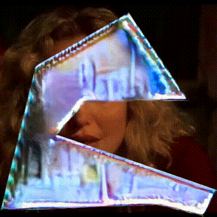

10. Так как лицо востановить не удалось, даже приблизительно, дальнейшие шаги (SimSwap, GPEN) были пропущены. Если взять видео с маской меньше, то на этом этапе уже может быть восстановлено лицо. Вставка вырезанного изображения в исходное видео было не сделано по той же причине.


## Другие эксперименты:
1. Пробовал применить [GPEN](https://github.com/yangxy/GPEN), но на выходе получил то же самое видео что и на входе, предполагаю что это произошло из за того, что GPEN не смог понять что нужно восстанавливать, т.е. где находится лицо.

1. Пробовал восстановить кадры через StableDiffusion, инструментом inpainting, закрашивая часть изображения с маской вручную, в итоге получил следующие результаты:
 - Восстановление полного кадра
 
 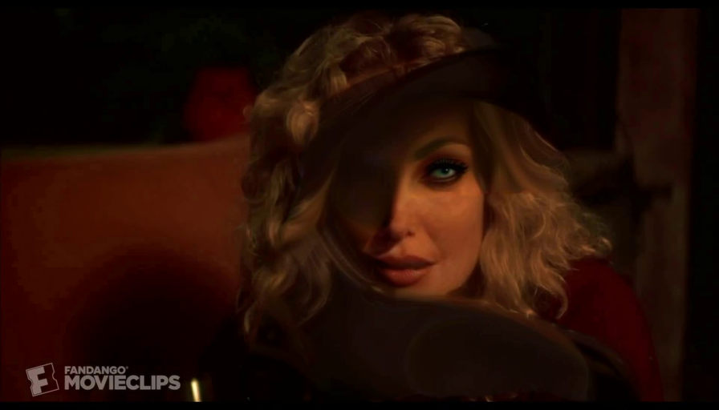  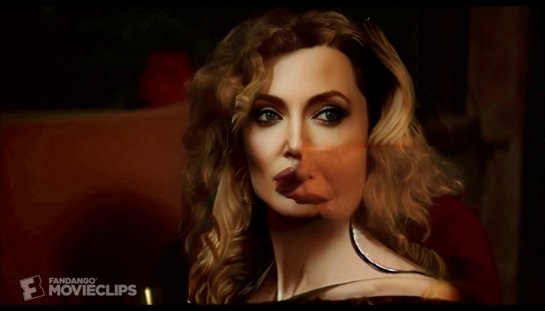

 - Восстановление лица и после всего остального 
 
  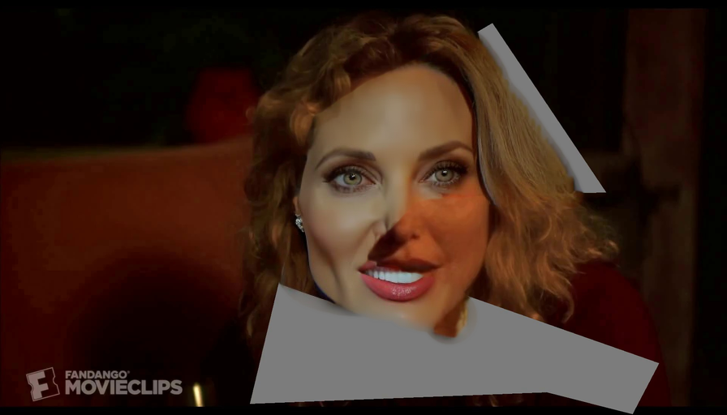  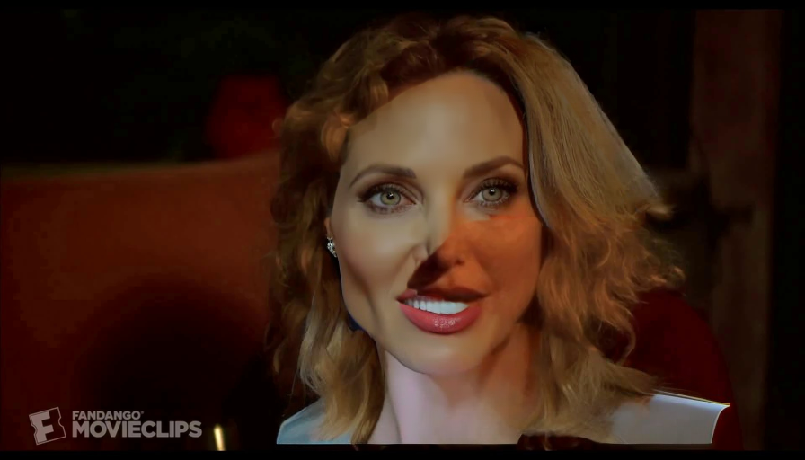   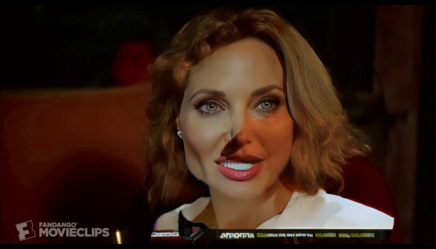


 - Восстановление отдельных частей лица (глаз) 
 
  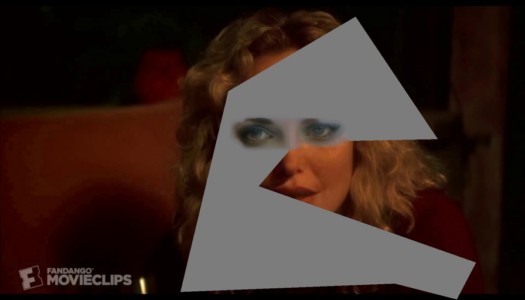  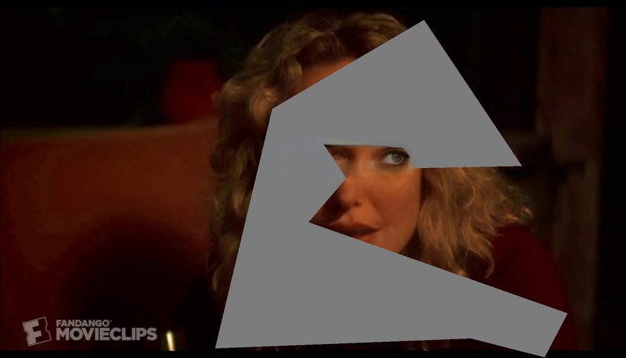

 - Использовать вырезанную часть и восстанавливать части лица постепенно 
 
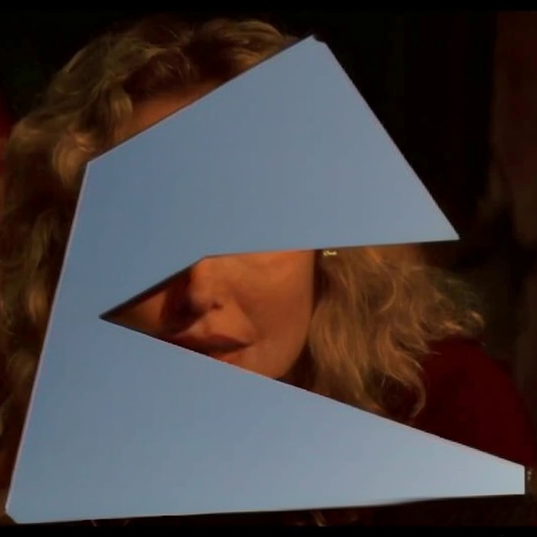 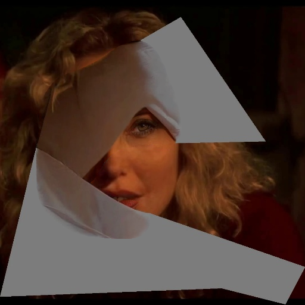 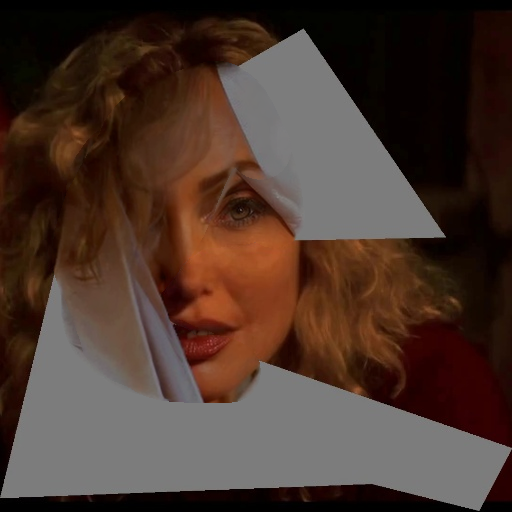 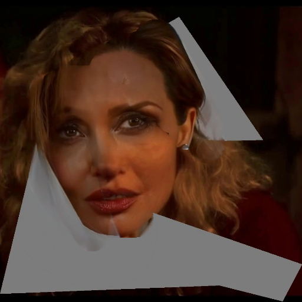 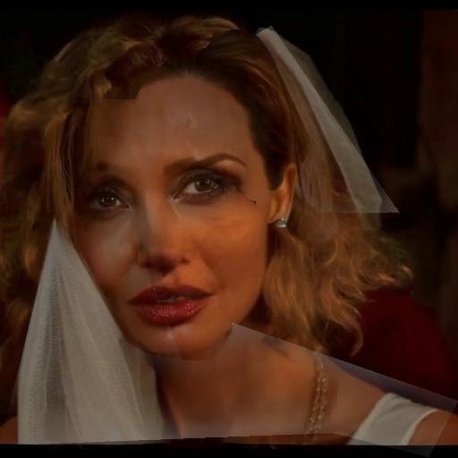 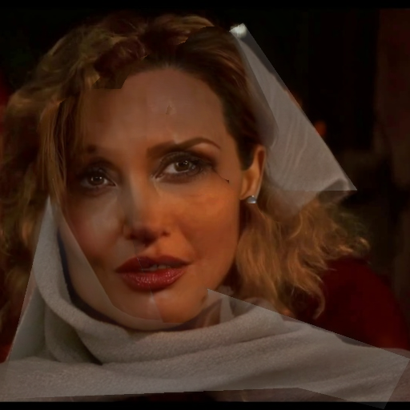

В результате видим что лицо восстановить можно, можно потом ещё применить GPEN, но восстановление одного лишь кадра заняло более двух часов перебора промптов и экспериментов.

  

